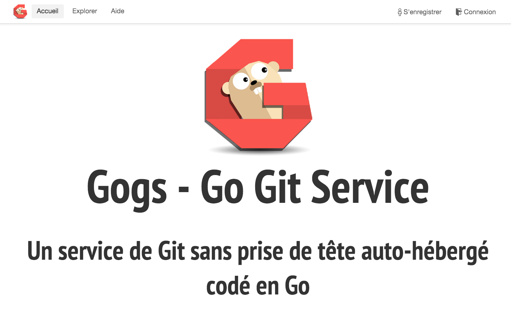
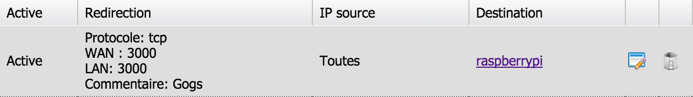

Gogs est un service Git auto-hébergé pour gérer le versionning de vos projets de manière simple, via une interface ergonomique, il est assez léger pour être installé sur votre Raspberry. Je vais vous détailler ici la procédure pour l'installer et y accéder depuis le web.

# Configuration requise

Dans un premier temps nous allons créer un utilisateur appelé git et avec lequel nous allons effectuer toutes les opérations d'installation de Gogs car c'est avec lui que nous lancerons le service.

	$ sudo adduser git
	$ su git

## Git + MySql

Avant d'installer Gogs, il faut s'assurer d'avoir installé un serveur MySql et Git sur votre Raspberry Pi. Si ça n'est pas le cas, tappez la commande suivante depuis votre terminal connecté en SSH à votre Raspberry.
	
	$ sudo apt-get update
	$ sudo apt-get install git mysql-server

## Création et configuration de la base de données

Maintenant il suffit de créer une base de données que l'on nommera `Gogs`

	$ mysql -u root -p
	mysql> CREATE DATABASE gogs CHARACTER SET utf8 COLLATE utf8_bin;
	mysql> EXIT

## Golang

Go est le language qui va servir à installer Gogs sur votre environnement. Comme nous avons besoin d'une version > 1.2, nous ne pouvons pas passer par `apt-get install` (dommage...) il va falloir le compiler manuellement la dernière version.

Pour cela, il suffit de récupérer les sources de Go pour la dernière version stable (ici 1.4.2) :

	$ mkdir local
	$ cd ~/local
	$ git clone https://go.googlesource.com/go
	$ cd go
	$ git checkout go1.4.2

Puis lancer la compilation en suivant, ça dure plus d'une heure sur un Raspberry Pi B+, il était temps de faire une pause de toute façon ;)

	$ cd ~/local/go/src
	$ ./all.bash

Une fois la compilation terminée, nous allons éditer le fichier des variables d'environnement de l'utilisateur :

	$ nano ~/.bashrc

Et y ajouter les lignes suivantes :

	export GOARM=5
	export GOROOT=$HOME/local/go
	export GOPATH=$HOME/go
	export PATH=$PATH:$GOROOT/bin:$GOPATH/bin

Puis éxecuter le contenu du fichier pour que les variables soient prisent en compte par le système.

	$ source ~/.bashrc

Maintenant l'instruction `go` doit fonctionner, pour vérifier que l'installation s'est déroulée correctement, vérifiez que la commande suivante retourne bien le numéro de version de Go :

	$ go version

# Installation de Gogs

Une fois votre environnement prêt, il reste à récupérer et compiler Gogs pour votre Raspberry Pi.

	$ go get -u github.com/gogits/gogs
	$ cd $GOPATH/src/github.com/gogits/gogs
	$ go build 

L'opération peut prendre quelque minutes, si elle rencontre des erreurs n'hésitez pas à vider `$GOPATH` et recommencer.

## Démarrez et configurez votre service

Vous pouvez maintenant démarrer votre serveur en tâche de fond en lançant la commande suivante depuis le répertoire d'installation de gogs `$GOPATH/src/github.com/gogits/gogs`.

	$ ./gogs web &

Vous pouvez maintenant ouvrir votre navigateur web à l'adresse suivante `http://raspi:3000/`, en remplaçant `raspi` par l'adresse IP (ou le nom) de votre Rapsberry Pi. 

La page d'installation de Gogs doit maintenant s'afficher. Après avoir rempli le formulaire de configuration, la page suivante devrait apparaître :

# Accessibilité depuis le web

Si vous avez un fournisseur d'accès et un routeur, vous pouvez ouvrir votre serveur privé à l'extérieur en ouvrant le port 3000 (si vous ne l'avez pas changé) depuis la configuration de votre box.

Il ne vous reste plus qu'a rattacher votre adresse IP sortante à un nom de domaine pour que vous puissiez la retenir et diffuser à vos collaborateurs. L'achat d'un nom de domaine n'est pas toujours nécessaire : avec free par exemple vous avez un domaine gratuit en `.hd.free.fr`, sinon vous pouvez vous tourner vers une solution de DynDNS gratuit comme [No-IP](http://www.noip.com/remote-access).

Et voila, vous pouvez profiter de votre serveur Git privé depuis n'importe quel poste connecté au réseau. En espérant que cet article vous a été utile. N'hésitez pas à me contacter ou me corriger si vous trouvez des erreurs/approximations.