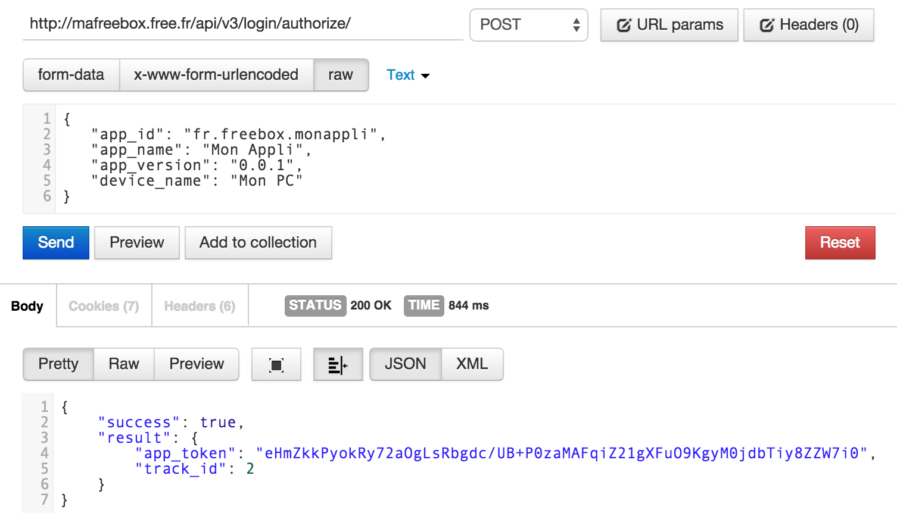

La Freebox possède une api REST riche en fonctionnalités qui permet notamment de diffuser du contenu en AirPlay ou suivre l'avancement des téléchargements. Pour l'utiliser depuis vos propres applications il faut nécessairement authentifier votre application et utiliser une clé de session pour chacun de vos appels.

## Comment ça marche

1. Obtenir une clé unique pour votre application

		+---------+                                       +---------+
		|   Mon   | POST /api/v3/login/authorize/ ======> | Freebox |
		|  Appli  |                                       |   API   |	
		|         | <====================== App Token === |         |
		+---------+                                       +---------+

2. Autoriser l'application en appuyant sur le bouton `>` de votre Freebox

3. Obtenir une clé de session

		+---------+                                       +---------+
		|   Mon   | GET /api/v3/login/ =================> | Freebox |
		|  Appli  |                                       |   API   |	
		|         | <====================== Challenge === |         |
		|         |                                       |         |	
		|         |                                       |         |	
		|         | POST /api/v3/login/session =========> |         |
		|         |      + password                       |         |	
		|         |                                       |         |	
		|         | <================== Session Token === |         |		
		+---------+                                       +---------+

## En détail

La première étape peut être effectuée manuellement avec un client HTTP type [Postman](https://chrome.google.com/webstore/detail/postman-rest-client/fdmmgilgnpjigdojojpjoooidkmcomcm). Il faut envoyer quelques informations sur votre application au service (format JSON).



N'oubliez pas d'activer l'autorisation depuis votre Freebox et conservez bien la valeur de `app_token`.

Pour la suite nous allons automatiser la récupération du jeton de session afin de ne pas répéter l'opération manuellement. Pour l'exemple je vais utiliser NodeJS.

1. Création d'une méthode pour effectuer les requêtes HTTP vers l'API
		
	```javascript
	var http = require('http')
	var Q = require('q')

	function request(path, method, headers) {
	
		var deferred = Q.defer();

		http.request({
			host: 'mafreebox.free.fr',
			path: path,
			method: method || 'GET',
			headers: headers || {}
		}, function(resp){
			var data = '';
			resp.on('data', function(chunk) {
	            data += chunk;
	        });
	        resp.on('end', function() {
	            deferred.resolve( JSON.parse(data) )
	        });
		}).end()

		return deferred.promise;
	}
	```

	J'ai utilisé la librairie [Q](https://github.com/kriskowal/q) pour retourner une promesse qui sera résolue une fois les données récupérées. Maintenant pour tester le bon fonctionnement de ma méthode je l'utilise de la manière suivante :

	```javascript
	request('/api/v3/login/').then(function(data){
		console.log(data);
	})
	```

	La méthode est opérationnelle mais il faut aussi pouvoir envoyer les paramètres d'appel au format JSON. Je rajoute donc un paramètre optionnel `content` et modifie l'implémentation en conséquence.

	```javascript
	function request(path, method, headers, content) {
		
		var deferred = Q.defer();

		content = content ? JSON.stringify(content) : '';

		headers = headers || {};	
		headers['Content-Length'] = content.length;
		headers['Content-Type'] = 'application/json';

		var req = http.request({
			host: 'mafreebox.free.fr',
			path: path,
			method: method || 'GET',
			headers: headers
		}, function(resp){
			var data = '';
			resp.on('data', function(chunk) {
	            data += chunk;
	        })
	        resp.on('end', function() {
	            deferred.resolve( JSON.parse(data) )
	        })        
		})

		req.on('error', function(e) {
			console.log('problem with request: ' + e.message);
		});

		req.write( content );
		req.end();	

		return deferred.promise;
	}
	```

2. On effectue les appels nécessaires à la récupération de la clé de session

	```javascript
	// inclusion de la lib de cryptage
	// de NodeJS pour générer le mot de passe
	var crypto = require('crypto')
	
	var APP_TOKEN = 'la valeur du app_token récupéré';

	// premier appel pour récupérer le challenge
	request('/api/v3/login/')
		
		// on retourne le challenge pour le passer à 
		// la fonction suivante
		.then(function(data){
			return data.result.challenge;
		})

		// puis on effectue le 2eme appel pour récupérer 
		// la clé de session
		.then(function(challenge){	
			return request('/api/v3/login/session/', 'POST', null, {
				app_id: APP_ID,
				// Génération du mot de passe à partir du challenge
				password: crypto.createHmac('sha1', APP_TOKEN)
								.update(challenge)
								.digest('hex')
			})
		})

		// On affiche le token en console 
		.then(function(data){
			console.log( data.result.session_token );
		})
	```

	Au deuxième appel j'ai envoyé un mot de passe généré à partir du challenge récupéré et de mon token d'application.

	Il faut maintenant conserver ce token et ne refaire l'appel que s'il est inexistant ou expiré.

	```javascript
	var Auth = function(appId, appToken){
		this._appId = appId;
		this._appToken = appToken
		// On initialise une propriété _sessionToken
		this._sessionToken = null;
	}

	Auth.prototype.authenticate = function( callback ){

		var _this = this;
		var requestHeaders = {};

		if (this._sessionToken) {
			// si un session token est présent, on le
			// passe à la requête
			requestHeaders['X-Fbx-App-Auth'] = this._sessionToken;
		}

		var proc = request('/api/v3/login/', 'GET', requestHeaders)
			.then(function(data){			
				// Dans le cas ou l'api renvoi logged_in = true
				// c'est que le token est toujours valide
				if (data.result.logged_in) {
					callback( _this._sessionToken );
					// On stoppe la procédure ici
					proc.end()
				}
				return data.result.challenge;
			})

			// [...]

			.then(function(data){			
				_this._sessionToken = data.result.session_token;
				console.log('new session token: ')
				console.log(_this._sessionToken)
				callback( _this._sessionToken )
			})
	}
	```

3. On met en place un serveur qui va se charger d'obtenir la clé

	Prenons le cas d'un serveur tout simple qui renvoi le Token de session lorsqu'on requête `http://localhost:4242`.
	C'est simple à mettre en place avec le framework [Express](http://expressjs.com/)

	```javascript
	var express = require('express');

	var APP_ID = 'fr.freebox.testapp';
	var APP_TOKEN = 'la valeur du app_token récupéré';

	var auth = new Auth(APP_ID, APP_TOKEN);

	var app = express();

	app.get('/', function(req, res) {
		auth.authenticate(function(token){
			res.status(200).json({
				session_token: token 
			});
		});  	
	})

	app.listen(4242)
	```
	Maintenant si vous avez envie de requêter directement l'API en JavaScript, ce ne sera pas possible en l'état car elle ne supporte pas les requêtes Cross-Domain... Heureusement qu'on peut tricher en passant par un proxy ;) Dans cet exemple j'utilise [RedBird](https://github.com/OptimalBits/redbird).

	```javascript
	// [...]

	var redbird = require('redbird')

	app.get('/', function(req, res){
		res.sendFile( __dirname + '/test.html' )
	})

	app.get('/token', function(req, res) {
		// [...]
	})

	app.listen(4243)

	var proxy = redbird({port: 4242, bunyan: false});

	// Les requêtes vers localhost arrivent sur le router Express
	proxy.register("localhost", "http://localhost:4243");
	// Les requêtes vers localhost/api mènent à l'API Freebox
	proxy.register("localhost/api", "http://mafreebox.free.fr/api/");
	```

	De cette manière je peux réaliser une requête Ajax authentifiée à l'API (dans mon fichier test.html)

	```javascript
	fetch('/api/v3/downloads', {
		headers: {
			'X-Fbx-App-Auth': {SESSION_TOKEN}
		}
	})
		.then(function(resp){
			resp.json().then(function(data){
			 	console.log(data)
			})
		})
	```

	Maintenant à vous de jouer. Le code source de cet exemple est [disponible ici](https://github.com/fbarrailla/freebox_auth).